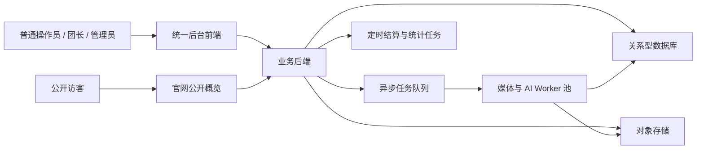
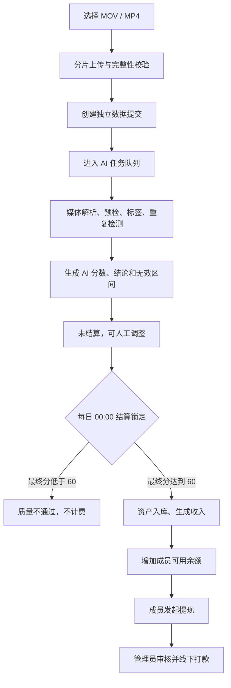

# 具身智能数据外包平台：一期技术总需求文档

- 文档状态：技术需求基线 v1.0（讨论版）
- 编写日期：2026-08-03
- 适用阶段：第一期
- 目标读者：产品负责人、前端开发、后端开发、AI/数据开发、测试人员
- 文档目标：让技术团队基于同一套业务规则完成范围评估、架构设计、任务拆分和开发验收
- 决策来源：
  - [总体方案与待确认事项](./具身智能数据外包平台-总体方案与待确认事项.md)
  - [详细方案草案](./docs/superpowers/specs/2026-07-28-embodied-data-outsourcing-platform-design.md)

---

## 1. 文档使用规则

### 1.1 优先级定义

- **P0：**第一期核心流程依赖，正式开发对应模块前必须明确。
- **P1：**可以使用本文推荐默认值开始开发，试运行前校准。
- **P2：**第一期不实现，只保留扩展能力。

### 1.2 需求词语

- **必须：**第一期验收要求。
- **应该：**推荐实现；如不实现，需要由产品负责人确认替代方案。
- **可以：**非阻塞增强能力。
- **暂不实现：**明确排除在第一期范围之外。

### 1.3 冲突处理

本文件是面向技术团队的一期需求总入口。若本文件与历史讨论稿存在冲突，以本文件中标记为“已确认”的规则为准；标记为“待确认”的内容不得由开发人员自行写死。

---

## 2. 产品目标与一期边界

### 2.1 产品目标

第一期建设一条可运营、可追溯的具身视频数据生产流水线：

```text
账号与团队管理
→ 数采人员自主上传视频
→ 异步 AI 标注与质量检测
→ 结算前可选人工调整
→ 每日结算和账户余额
→ 数据资产入库
→ 数据分布统计与公开概览
```

平台不采用强制任务派发模式。数采人员根据采集指南和数据缺口自主采集、上传；系统自动判断视频内容、场景、质量和计费结果。

### 2.2 一期必须实现

- 同一套账号密码登录和三种角色视图。
- 平台管理员、团长、普通操作员三级角色。
- 团队和成员管理。
- MOV、MP4 视频批量选择、分片上传和断点续传。
- 每个视频独立形成一份数据提交。
- 媒体参数解析、预览视频和缩略图。
- AI 任务队列、可扩展 Worker、失败重试和管理员重跑。
- 场景、动作、对象和工具的基础 AI 标签。
- 百分制自动质检、证据和问题时间段。
- 重复候选检测。
- 管理员和团长在结算前人工调整。
- 数据资产入库、内部数据分布统计。
- 平台默认单价、团队覆盖价、质量系数和有效计费时长。
- 每日结算、成员账户余额、收入流水。
- 成员手动提现、管理员审核和线下打款记录。
- 简单的官网公开数据概览。
- 操作审计和数据权限隔离。

### 2.3 一期明确不实现

- 录制 App 或采集设备控制。
- IMU、6DoF、深度、标定文件和专业设备数据包。
- ZIP 数据包上传。
- 强制任务派发、抢单和任务验收。
- 强制人工抽检流程。
- 采购商注册、登录、在线购买和在线数据交付。
- 团长佣金、团队差价和渠道账户。
- 个人特殊成员单价。
- 自动支付接口和自动提现。
- 结算后冲正、补差和历史账务修改。
- 独立运营、质检、财务岗位。
- 独立客服会话和工单系统；一期使用失败原因、改进建议和管理员线下处理。
- 复杂微服务、Kubernetes 和自建模型训练平台。

### 2.4 一期技术接入范围

- 支持文件扩展名：`.mov`、`.mp4`。
- 后端必须检查真实容器格式，不能只相信扩展名。
- 不对分辨率、帧率、码率、编码和时长设置业务准入门槛。
- 媒体参数需要自动解析、保存并在详情页展示。
- 文件损坏、容器伪造、无法读取视频流属于技术上传失败。
- 单文件大小上限属于部署配置，当前尚未确定。

---

## 3. 用户、组织和权限

### 3.1 组织结构

```text
平台
├── 团长 A
│   ├── 普通操作员 A1
│   ├── 普通操作员 A2
│   └── 约 20 名普通操作员
├── 团长 B
│   └── 约 20 名普通操作员
└── 其他团队
```

- 一个普通操作员只能属于一个团队。
- 一个团长管理一个团队。
- 团长下面不能继续发展下一级团长。
- 约 20 人是运营建议，不是一期强制上限。

### 3.2 角色权限矩阵

| 能力 | 普通操作员 | 团长 | 平台管理员 |
|---|---:|---:|---:|
| 使用账号密码登录 | 是 | 是 | 是 |
| 上传自己的视频 | 是 | 是 | 否 |
| 查看自己的视频和结果 | 是 | 是 | 全平台查看 |
| 查看本团成员视频 | 否 | 是 | 是 |
| 查看其他团队数据 | 否 | 否 | 是 |
| 调整未结算质量结果 | 否 | 本团 | 全平台 |
| 调整未结算无效区间 | 否 | 本团 | 全平台 |
| 添加、移除本团成员 | 否 | 是 | 是 |
| 创建用户、设置角色 | 否 | 否 | 是 |
| 修改标签、模型和质检规则 | 否 | 否 | 是 |
| 修改默认价、团队价 | 否 | 否 | 是 |
| 查看自己的余额并提现 | 是 | 是 | 否 |
| 查看本团汇总收入 | 否 | 只读汇总 | 是 |
| 审核提现 | 否 | 否 | 是 |
| 配置公开统计 | 否 | 否 | 是 |

### 3.3 权限实现要求

- 前端按角色隐藏菜单、页面和按钮。
- 后端接口必须再次校验角色和数据范围。
- 团长的数据查询必须强制附带所属团队条件。
- 普通操作员的数据查询必须强制附带本人用户条件。
- 文件预览地址必须使用短期签名，不能公开永久对象存储地址。
- 所有人工调整、价格、结算、提现和用户管理操作必须写入审计日志。

---

## 4. 系统总体形态

### 4.1 推荐架构

采用：

> **模块化单体业务系统 + 关系型数据库 + 对象存储 + 任务队列 + 独立 AI/媒体 Worker。**

原因：

- 符合产品负责人加 1～2 名开发人员的团队规模。
- 登录、团队、上传、质检、结算等事务保持在一个业务后端内。
- AI、转码、抽帧和重复检测通过异步 Worker 横向扩容。
- 后续如数据量明显增长，可以按模块拆分服务，不需要第一期提前微服务化。

### 4.2 系统组件



### 4.3 后端业务模块

- 身份与账号模块。
- 团队与成员模块。
- 上传批次与数据提交模块。
- 文件、媒体和对象存储模块。
- AI 任务和 Worker 调度模块。
- 标签与时间片段模块。
- 质量检测与人工调整模块。
- 重复检测模块。
- 数据资产模块。
- 统计与公开快照模块。
- 单价、计价和结算模块。
- 账户余额、流水和提现模块。
- 通知与审计模块。

### 4.4 前端路由建议

- `/login`：统一登录页。
- `/collector/*`：普通操作员工作台。
- `/team/*`：团长管理端。
- `/admin/*`：平台管理员后台。
- `/market`：公开数据概览。

路由只用于页面组织，不能替代后端权限控制。

---

## 5. 核心业务流程



### 5.1 关键时间点

- `upload_completed_at`：单文件上传和完整性校验完成时间。
- `quality_completed_at`：AI 首次成功生成完整质检结果的时间。
- `settled_at`：日结算批次锁定该记录的时间。
- `credited_at`：收入进入成员余额的时间。

当前已确认日结算按 `quality_completed_at` 归属自然日。

### 5.2 主流程约束

- 批量选择只是上传归组，不形成不可拆分的数据包。
- 每个视频独立上传、排队、质检、调整、入库和计价。
- 一个文件失败不能阻塞同批其他文件。
- AI 系统错误不能被记录为视频质量失败。
- 未设置强制人工复核，AI 完成后直接进入未结算阶段。
- 未结算期间，管理员和团长可以按权限修改最终结果。
- 每天 00:00 锁定前一自然日完成质检的数据。
- 锁定后第一期不允许修改质量和金额。

---

## 6. 页面和交互需求

### 6.0 登录后公共交互

所有角色页面统一提供：

- 当前账号和角色展示。
- `修改密码`：输入旧密码、新密码和确认密码。
- `退出登录`：清理当前会话并返回登录页。
- 会话过期后跳转登录页，登录成功可返回原有权限的目标页。
- 无权访问页面时显示无权限提示，不能只依赖前端自动跳转。
- 列表页面统一支持分页、加载中、空状态和请求失败重试。

### 6.1 公共页面

#### 6.1.1 官网数据概览 `/market`

展示：

- 可交付视频数量。
- 可交付有效时长。
- 场景大类分布。
- 动作类别分布。
- 数据增长趋势。
- 质量概览。
- 脱敏样例。
- 商务咨询入口。

规则：

- 只使用已结算锁定、最终通过并可交付的数据。
- 不展示成员身份、团队经营数据、精确库存明细和内部质检证据。
- 公开数据默认按天刷新。
- 第一期不提供筛选后下载、采购商登录和在线购买。

### 6.2 统一登录页

字段：

- 账号。
- 密码。

按钮和交互：

- `登录`：校验成功后按角色进入对应首页。
- 登录失败显示通用错误，不暴露账号是否存在。
- 第一期不提供自助注册、短信验证码、忘记密码和第三方登录。

### 6.3 普通操作员工作台

#### 6.3.1 首页

展示：

- 今日/累计上传数量。
- 排队中、处理中、通过、失败数量。
- 待结算金额。
- 可用余额。
- 推荐采集场景。
- 最近质检结果。

主要入口：

- `上传视频`。
- `查看全部数据`。
- `查看余额`。
- `查看采集建议`。

#### 6.3.2 视频上传页

功能：

- 多选 MOV、MP4。
- 拖拽选择。
- 显示文件名、大小、上传速度、进度和状态。
- 支持暂停、继续、取消和单文件重试。
- 显示批次总进度、成功数和失败数。

按钮：

- `选择视频`。
- `开始上传`。
- `暂停全部`。
- `继续全部`。
- `取消未完成上传`。
- 单文件 `暂停`、`继续`、`重试`、`移除`。

约束：

- 前端文件选择器限制扩展名。
- 后端仍检查真实容器。
- 单文件校验完成后立即创建 AI 任务，不等待同批其他文件。

#### 6.3.3 我的数据列表

字段建议：

- 缩略图。
- 数据 ID。
- 原始文件名。
- 上传时间。
- 原始时长。
- 有效时长。
- AI/最终分数。
- 质量结论。
- AI 处理状态。
- 结算状态。
- 预计或最终收入。

筛选：

- 上传时间。
- AI 处理状态。
- 质量结论。
- 结算状态。
- 场景标签。

交互：

- 点击行进入详情。
- 失败记录显示失败原因和改进建议。
- 第一期返工采用重新上传新视频，关联规则仍待确认。

#### 6.3.4 视频详情

展示：

- 视频播放器。
- 媒体参数。
- 原始时长、无效时长和有效计费时长。
- 时间轴上的无效区间。
- AI 原始分、最终分和质量结论。
- 五项分数。
- 扣分原因、问题时间段和证据帧。
- 场景、动作、对象和工具标签。
- 适用单价、质量系数、预计/最终收入。
- AI 处理、人工调整和结算状态。

普通操作员只能查看，不能修改质检结果。

#### 6.3.5 数据分布与采集建议

展示：

- 场景和动作占比。
- 当前缺口较大的方向。
- 已经较饱和的方向。
- 采集规范和常见失败原因。

稀缺度只用于引导，不产生稀缺奖金。

#### 6.3.6 账户与提现

展示：

- 待结算金额。
- 可用余额。
- 提现处理中金额。
- 累计已结算。
- 累计已提现。
- 收入和提现流水。

提现交互：

- 输入提现金额。
- 展示最低提现额和可用余额。
- 选择已保存的支付宝收款信息。
- `提交提现`后立即冻结金额。
- 管理员审核前可以`撤回`。
- 查看待审核、待打款、已完成、已驳回、打款失败状态和原因。

### 6.4 团长管理端

团长拥有普通操作员全部个人能力，并增加以下页面。

#### 6.4.1 团队首页

展示：

- 团队人数。
- 上传量和有效时长。
- 通过率、失败率和平均分。
- 待处理异常。
- 成员贡献排行。
- 团队场景和动作分布。
- 当前团队适用单价及来源。

#### 6.4.2 成员管理

列表字段：

- 账号、姓名/昵称。
- 加入时间。
- 账号状态。
- 上传量、有效时长、通过率。

按钮：

- `添加成员`。
- `移除成员`。
- `查看成员数据`。

规则：

- 只能管理本团普通操作员。
- 团长不能创建新的团长。
- 系统账号仍由平台管理员创建；团长的“添加成员”只负责把未分配的普通操作员账号加入本团。
- 移除成员后的历史数据、结算和流水必须保留。

#### 6.4.3 团队数据列表和详情

- 只能查询本团数据。
- 可以播放视频、查看 AI 证据和结算前结果。
- 对未结算数据可以修改最终分、最终结论和无效区间。
- 团长修改直接生效，不需要管理员再次确认。
- 修改必须填写原因并生成审计记录。
- 已结算数据只读。

### 6.5 平台管理员后台

#### 6.5.1 运营总览

展示：

- 用户和团队数量。
- 上传量、排队量、处理吞吐。
- AI 成功率、重试和系统失败。
- 质量通过率、分数分布。
- 原始时长、有效时长。
- 场景和动作分布。
- 待结算金额、当日入账和余额总额。
- 待审核提现。

#### 6.5.2 用户与团队管理

用户功能：

- 新增账号。
- 设置初始密码。
- 设置角色。
- 配置所属团队。
- 启用、停用账号。
- 查看基础状态。

团队功能：

- 新建团队。
- 指定团长。
- 查看和调整成员。
- 查看团队数据和汇总。

#### 6.5.3 数据提交列表

字段：

- 缩略图、数据 ID、上传人、团队。
- 文件名、上传时间、原始时长、有效时长。
- AI 状态、最终分、质量结论。
- 场景标签。
- 结算状态和金额。

筛选：

- 数据 ID、账号、团队。
- 上传/质检时间。
- AI 状态、质量结论、结算状态。
- 分数区间、场景、动作。
- 是否重复候选。

操作：

- 查看详情。
- 重跑失败 AI 任务。
- 对未结算数据进行人工调整。
- 对候选资产执行下架或恢复。

#### 6.5.4 AI 任务队列

展示：

- 排队、处理中、重试中、系统失败和成功数量。
- Worker 状态、当前任务、心跳和耗时。
- 每个任务所处处理阶段。
- 错误码、重试次数和最后错误。

操作：

- 重试单条任务。
- 批量重试系统失败任务。
- 取消尚未执行任务。
- 从指定处理阶段重跑。

#### 6.5.5 标签、规则和模型版本

一期至少支持：

- 标签树查看和维护。
- 质检规则版本查看。
- 质量系数规则版本查看。
- AI 模型版本查看。
- 启用/停用规则版本。

标签树和具体质检阈值属于待确认 P0，不应在业务代码中写死。

#### 6.5.6 重复候选

展示：

- 文件完全重复。
- 视觉近似重复候选。
- 相似度、关联数据和证据帧。

第一期文件哈希可自动拦截完全重复；视觉近似数据先标记候选，具体自动拒绝阈值待确认。

#### 6.5.7 数据资产和分布

功能：

- 查看候选资产、已入库、已下架。
- 按场景、动作、对象、工具、团队和时间统计。
- 从统计下钻到视频和时间区间。
- 生成公开统计快照。

#### 6.5.8 单价管理

功能：

- 设置平台默认成员单价。
- 新增、修改、停用团队覆盖价。
- 查看每个团队当前价格和价格来源。
- 查看价格变更历史。

规则：

- 不设置个人价。
- 团队价优先于平台默认价。
- 团队价停用后自动回退平台默认价。
- 新旧价格的生效时间锚点尚待确认。

#### 6.5.9 结算与账户

功能：

- 查看日结算批次。
- 查看批次包含的数据、成功数、失败数和金额。
- 查看成员余额和收入流水。
- 检查单条数据使用的价格、时长、分数和系数快照。
- 对异常的未完成结算任务执行重试。

第一期不允许修改已经成功结算的数据。

#### 6.5.10 提现管理

状态：

```text
待审核
├── 用户已撤回
├── 已驳回
└── 待打款
    ├── 已完成
    └── 打款失败
```

操作：

- 查看申请人、金额和支付宝账户快照。
- 审核通过。
- 驳回并填写原因。
- 标记线下打款成功。
- 标记打款失败并填写原因。

资金规则：

- 申请提交立即冻结金额。
- 撤回、驳回或打款失败时退回可用余额。
- 同一用户同时只能有一笔未完成申请。
- 默认最低提现 100 元，管理员可配置。
- 第一期不收提现手续费。

#### 6.5.11 审计日志

至少记录：

- 用户、团队和角色变更。
- AI 任务重跑。
- 人工质量和无效区间调整。
- 标签、规则和模型版本变更。
- 单价变更。
- 结算任务操作。
- 提现审核和打款状态变更。

---

## 7. 上传、文件和媒体处理

### 7.1 数据单位

- 一次多选创建一个上传批次。
- 批次内每个视频创建独立的数据提交。
- 一个数据提交第一期只包含一个原始视频。
- 底层模型保留未来一份提交包含多个文件的能力。

### 7.2 上传要求

- 大文件分片上传。
- 断点续传。
- 单分片和完整文件校验。
- 单文件暂停、继续、取消和重试。
- 上传完成接口必须幂等。
- 同一文件重复完成请求不能创建两份数据提交。
- 建议保存 SHA-256 等文件哈希。

### 7.3 媒体派生文件

上传成功后异步生成：

- 低码率网页预览视频。
- 缩略图。
- 质检抽帧。
- 必要的音视频媒体信息。

### 7.4 媒体元数据

至少保存：

- 原始文件名。
- 容器格式。
- 视频编码。
- 分辨率。
- 帧率。
- 码率。
- 原始时长。
- 文件大小。
- 是否有音轨。
- 上传完成时间。
- 文件哈希。

---

## 8. AI 任务队列和处理流水线

### 8.1 触发规则

单文件完成上传、校验和媒体基本解析后，立即创建独立 AI 任务。

### 8.2 处理阶段

1. 媒体解析。
2. 预览、缩略图和抽帧。
3. 基础画面质量检测。
4. 场景和内容标签。
5. 动作和交互识别。
6. 无效计费区间检测。
7. 文件哈希和视觉重复候选检索。
8. 综合评分和建议生成。
9. 保存完整 AI 结果。

### 8.3 Worker 要求

- 多台 Worker 可以并行领取不同视频。
- 单任务同一时刻只能由一个有效 Worker 持有。
- Worker 需要租约或心跳，宕机后任务可重新领取。
- 每个处理阶段必须幂等。
- 任务保存当前阶段、尝试次数、开始/结束时间和错误。
- 支持配置最大并发、超时和重试次数。
- 模型服务不可用时进入重试，不生成质量失败。

### 8.4 AI 任务状态

```text
待创建
→ 排队中
→ 处理中
   ├── 媒体解析
   ├── 质量预检
   ├── 标签识别
   ├── 重复检测
   └── 综合评分
→ 处理成功

处理中
→ 重试中
→ 系统处理失败
```

---

## 9. AI 标签需求

### 9.1 视频级标签

- 主场景。
- 次场景。
- 环境类型。
- 核心任务摘要。
- 主要对象。
- 主要工具。
- 是否存在多人。
- 是否为第一视角。

### 9.2 时间片段级标签

每个片段至少包含：

- 开始时间。
- 结束时间。
- 动作标签。
- 对象标签。
- 工具标签。
- 置信度。
- 模型版本。

### 9.3 标签使用

- 内部搜索和筛选。
- 场景、动作覆盖统计。
- 采集缺口提示。
- 重复候选辅助。
- 对外数据能力概览。

### 9.4 待确认

第一版场景、动作、对象和工具标签树尚未锁定。开发应使用可配置标签表和多对多关系，不得使用代码枚举写死业务标签。

---

## 10. 自动质检和人工调整

### 10.1 AI 评分

采用 100 分制，建议五个维度各 20 分：

1. 第一视角和构图规范。
2. 手部和操作对象可见性。
3. 清晰度、曝光、抖动和画面稳定性。
4. 动作完整性和时序合理性。
5. 内容真实性和数据可用性。

### 10.2 通过门槛

- 最终分达到 60：质量通过。
- 最终分低于 60：质量不通过，不入库、不计费。
- 命中硬性淘汰项时，最终分必须低于 60，不能被其他高分抵消。
- 硬性淘汰项和具体扣分值尚待形成《质检规则 v1》。

### 10.3 质量结果数据

至少保存：

- AI 原始总分和五项分数。
- AI 原始结论。
- 最终总分和五项分数。
- 最终结论。
- 综合评语。
- 扣分原因代码和扣分值。
- 问题时间范围。
- 证据帧。
- 检测置信度。
- 改进建议。
- 模型版本和规则版本。
- AI 完成时间。

### 10.4 人工调整

- 不设置强制人工抽检队列。
- 管理员可调整全平台未结算视频。
- 团长可调整本团未结算视频。
- 团长的修改直接生效。
- 普通操作员不能修改。
- 可修改最终分、最终结论和无效计费区间。
- 人工结果不能覆盖 AI 原始结果。
- 每次修改必须保存修改人、角色、原因、时间和前后值。
- 进入日结算批次后数据只读。

### 10.5 系统失败和质量失败分离

```text
AI 任务状态：成功 / 系统处理失败
质量结论：通过 / 质量不通过
```

只有成功生成完整 AI 结果后才能产生质量结论。网络、Worker、模型服务和程序错误不能归因于数采人员。

---

## 11. 有效计费时长

### 11.1 公式

```text
有效秒数 = max(0, 原始秒数 − 合并后的无效区间总秒数)
有效计费时长（小时） = 有效秒数 ÷ 3600
```

### 11.2 明确无效区间

- 正式操作前的设备佩戴、镜头调整和准备。
- 最后一次有效操作后的收尾和无关录制。
- 持续较长时间没有有效操作的静止或等待。
- 人员离开操作场景、没有有效交互。
- 镜头完全遮挡、持续全黑或无法辨认。
- 与本次具身操作无关的中断。

### 11.3 默认阈值

- 普通无动作连续达到 5 秒后才作为无效候选。
- 完全遮挡、全黑或无法辨认连续达到 1 秒后可作为无效候选。
- 阈值必须可配置并保存规则版本。
- 正常操作中的短暂停顿、思考和动作衔接仍计费。
- 重叠无效区间求并集后只扣一次。

### 11.4 人工调整

- 不允许直接输入没有证据的有效时长数字。
- 管理员和团长通过增加、删除或调整无效区间修正时长。
- 每个区间保存起止时间、原因、置信度、来源和版本。
- 结算保存原始时长、无效区间快照、有效秒数和规则版本。

---

## 12. 重复检测

### 12.1 文件完全重复

- 使用文件哈希识别。
- 同一文件重复上传需要拦截或标记为不计费。
- 是否允许不同成员重复提交相同文件，需要在重复规则中明确。

### 12.2 视觉近似重复

- AI 生成视频级或片段级视觉特征。
- 在资产库中检索相似候选。
- 第一阶段先提供候选列表和相似度证据。
- 自动拒绝阈值和人工处理规则尚待确认。

---

## 13. 数据资产和统计

### 13.1 资产状态

```text
未入库
→ 候选资产
→ 已入库
→ 已归档 / 已下架
```

### 13.2 入库规则

- AI 结果生成后可以创建候选资产。
- 日结算锁定时最终通过的数据成为稳定可交付资产。
- 最终不通过的数据不进入可交付统计。
- 授权、隐私或重复问题可以导致资产下架，但保留历史处理记录。

### 13.3 内部统计口径

至少支持：

- 数据提交数、视频数。
- 原始时长、有效时长。
- 质量通过率、失败率。
- 质量分布。
- 场景、动作、对象和工具分布。
- 团队和成员贡献。
- 时间趋势。
- 重复候选比例。
- 场景与动作交叉分布。

### 13.4 公开统计口径

只统计：

- 已结算锁定。
- 最终质量通过。
- 资产状态为已入库。
- 允许公开展示。

公开统计建议使用每日快照，避免官网实时查询内部明细。

---

## 14. 计价、结算、余额和提现

### 14.1 成员单价

```text
实际成员单价 =
  团队存在有效覆盖价 ? 团队覆盖价 : 平台默认成员单价
```

规则：

- 平台默认成员单价必须存在。
- 团队覆盖价可选。
- 不设置个人价。
- 只有管理员可以修改。
- 单位为人民币元/小时，必须大于 0，最多两位小数。
- 价格变更保存操作人、原因、前后值和时间。
- 价格生效时间锚点仍为 P0 待确认项。

### 14.2 质量系数

| 最终质量分 `score` | 质量系数 `Q` |
|---|---:|
| `score < 60` | 0 |
| `60 ≤ score < 70` | 0.7 |
| `70 ≤ score < 80` | 0.85 |
| `80 ≤ score ≤ 100` | 1.0 |

- 只扣不奖，最高系数为 1。
- 命中硬性淘汰项时 `Q = 0`。
- 结算使用最终分，不直接使用 AI 原始分。
- 系数规则需要版本和生效时间。

### 14.3 收入公式

```text
收入 = 成员单价（元/小时）× 有效秒数 ÷ 3600 × 质量系数
```

- 单条收入使用完整精度计算。
- 最后四舍五入到人民币分。
- 日批次汇总已经完成单条舍入的金额。
- 金额字段必须使用整数分或定点小数，禁止使用浮点数。

### 14.4 每日结算

- 业务时区：Asia/Shanghai。
- 每天 00:00 创建日结算批次。
- 批次处理前一自然日 `quality_completed_at` 范围内的数据。
- 批次开始后锁定纳入记录，阻止并发人工修改。
- 最终通过的数据生成收入并增加成员可用余额。
- 最终不通过的数据锁定为不计费。
- 同一数据只能正常结算一次。
- 结算任务必须幂等，重复执行不能重复入账。
- 单条失败不应导致整个批次回滚，可单独重试。

结算快照至少保存：

- 数据 ID。
- 成员和团队。
- 价格及价格来源。
- 原始时长、无效区间和有效时长。
- 最终分和质量系数。
- 计价规则版本。
- 单条金额。
- 所属结算批次。

### 14.5 账户余额

账户字段：

- 待结算金额。
- 可用余额。
- 提现冻结金额。
- 累计已结算金额。
- 累计已提现金额。

原则：

- 余额只能通过流水变化，不能直接修改数字。
- 每次结算入账、提现冻结、退回和提现完成都生成不可删除流水。
- 第一期不提供已结算收入冲正。

### 14.6 提现

- 用户可以输入不超过可用余额的金额。
- 默认最低提现 100 元，可由管理员配置。
- 同时只能存在一笔未完成申请。
- 提交后立即冻结金额。
- 审核前用户可以撤回。
- 管理员审核后通过支付宝线下转账。
- 提交时保存收款人姓名和支付宝账号快照。
- 驳回和打款失败必须填写原因并退回冻结金额。
- 第一期不接支付 API，不收提现手续费。

---

## 15. 核心状态机

### 15.1 上传状态

```text
待上传 → 上传中 → 校验中 → 上传完成
                   └→ 上传失败
```

### 15.2 AI 任务状态

```text
待创建 → 排队中 → 处理中 → 处理成功
                    └→ 重试中 → 系统处理失败
```

### 15.3 质量状态

```text
未评分
→ AI 通过 / AI 质量不通过
→ 最终通过 / 最终质量不通过
```

人工调整不是必经状态，通过审核记录表达。

### 15.4 结算状态

```text
未计价
→ 待结算（可调整）
→ 结算处理中（锁定）
→ 已计入账户余额 / 不计费关闭
```

### 15.5 提现状态

```text
待审核
├── 用户已撤回
├── 已驳回
└── 待打款
    ├── 已完成
    └── 打款失败
```

状态必须拆分存储，不能使用一个 `status` 同时表达上传、AI、质量、资产、结算和提现。

---

## 16. 核心数据对象

### 16.1 用户和组织

- `User`：账号、密码摘要、角色、状态。
- `Team`：团队、团长、状态。
- `TeamMember`：成员归属关系和历史。
- `RolePermission`：可扩展权限点。

### 16.2 上传和文件

- `UploadBatch`：一次多选上传的归组。
- `DataSubmission`：一个视频对应的一份数据提交。
- `RawFile`：原始文件、哈希、对象存储地址。
- `MediaMetadata`：编码、分辨率、帧率、码率和时长。
- `DerivedFile`：预览、缩略图和抽帧。

### 16.3 AI、标签和质量

- `ProcessingJob`：任务、阶段、尝试次数、错误和耗时。
- `ModelRun`：模型和规则版本、原始输出。
- `VideoLabel`：视频级标签。
- `SegmentLabel`：片段级标签。
- `QualityResult`：AI 原始分、最终分和结论。
- `QualityIssue`：原因、扣分、证据帧和问题区间。
- `InvalidInterval`：计费无效区间。
- `ManualReview`：人工调整记录。
- `DuplicateCandidate`：相似候选和相似度。

### 16.4 资产和统计

- `DataAsset`：候选、入库、下架状态。
- `AssetVersion`：资产版本和派生结果。
- `DistributionSnapshot`：内部统计快照。
- `PublicSnapshot`：公开统计快照。

### 16.5 价格和资金

- `PriceRule`：平台默认价或团队覆盖价、版本和状态。
- `PricingRecord`：单条数据计价快照。
- `SettlementBatch`：日结算批次。
- `WalletAccount`：账户余额汇总。
- `LedgerEntry`：不可删除的资金流水。
- `WithdrawalRequest`：提现申请和收款账户快照。

### 16.6 审计

- `AuditLog`：操作者、动作、对象、前后值、原因、时间和请求追踪 ID。

---

## 17. 数据存储和生命周期

### 17.1 分层存储

1. **原始层：**用户上传的原始视频，只读保存。
2. **处理层：**预览、缩略图、抽帧、特征和模型输出。
3. **资产层：**可交付资产、标签、质量结果和版本。
4. **统计层：**内部和公开统计快照。

### 17.2 数据删除

- 业务页面删除默认使用逻辑删除或下架。
- 原始文件物理删除需要独立高风险流程。
- 质量、结算、资金和审计记录不得随普通页面删除。
- 具体文件保留周期和隐私删除规范尚待确认。

### 17.3 数据库和对象存储一致性

- 数据库保存对象存储键、大小、哈希和版本。
- 定期执行数据库记录与对象存储文件核对。
- 文件上传成功但数据库提交失败时需要自动清理或补偿。
- 数据库成功但文件缺失时需要报警。

---

## 18. 定时任务

至少包含：

- 每日 00:00 结算批次。
- 内部统计聚合。
- 公开统计每日快照。
- 超时 AI 任务回收。
- 对象存储一致性检查。
- 失败任务和结算异常提醒。

所有定时任务必须：

- 支持幂等。
- 记录开始时间、结束时间、结果和错误。
- 支持管理员手动补跑。
- 避免同一时间重复执行同一业务批次。

---

## 19. 非功能要求

### 19.1 正确性

- 金额禁止使用浮点数。
- 时长内部建议使用整数毫秒或微秒。
- 所有时间保存 UTC，页面按 Asia/Shanghai 展示。
- 业务日结算按 Asia/Shanghai 自然日计算。
- 数据和资金写入使用数据库事务或可靠补偿机制。

### 19.2 幂等和并发

- 上传完成、创建 AI 任务、生成资产、日结算和余额入账必须幂等。
- 使用业务唯一键防止重复数据、重复任务和重复流水。
- 结算锁定和人工调整之间必须有并发控制。
- 提现申请冻结余额需要原子校验和扣减。

### 19.3 可观测性

- 每个请求、数据提交和 AI 任务使用可追踪 ID。
- 记录阶段耗时、队列等待时间、AI 成功率和错误码。
- 监控队列积压、Worker 心跳、结算失败和存储异常。
- 管理员后台展示关键运行指标。

### 19.4 安全

- 密码使用安全哈希保存。
- 服务端执行角色和数据范围校验。
- 对象存储使用私有桶和短期签名 URL。
- 日志不得记录密码、完整收款账号和对象存储密钥。
- 管理员高风险操作必须审计。

### 19.5 性能和容量

当前用户量、日上传量、文件大小和存储规模尚不能可靠估算，因此不写死性能数字。

工程必须保留：

- 对象存储直传或分片上传。
- 可配置 Worker 并发。
- 多 Worker 横向扩容。
- 无状态业务 API。
- 数据库索引和分页查询。
- 统计快照，避免首页实时扫描大表。

上线前必须使用真实视频样本重新完成容量和成本测算。

### 19.6 环境、备份和恢复

- 开发、测试和生产环境必须隔离数据库、对象存储、队列和密钥。
- 测试环境不得向真实支付宝账户执行打款。
- 关系型数据库必须配置自动备份。
- 对象存储应启用版本、软删除或等价的误删保护能力。
- 正式上线前至少完成一次数据库和关键文件恢复演练。
- RPO、RTO 和备份保存周期在部署环境确定后补充。

---

## 20. 异常处理要求

| 异常 | 用户侧表现 | 系统处理 |
|---|---|---|
| 文件格式不支持 | 上传前提示 | 不创建数据提交 |
| 文件损坏或无法解析 | 技术上传失败 | 保留错误码，可重新上传 |
| 分片上传中断 | 显示暂停/失败 | 支持断点续传 |
| AI 服务超时 | 处理中/重试中 | 自动重试，不产生质量失败 |
| AI 达到重试上限 | 系统处理失败 | 管理员重跑 |
| 视频低于 60 分 | 质量不通过 | 保存原因，不计费 |
| 结算单条失败 | 批次部分异常 | 其他记录继续，单条补跑 |
| 重复结算请求 | 不重复入账 | 幂等返回原结果 |
| 提现余额不足 | 表单校验失败 | 原子校验，不冻结 |
| 提现被驳回 | 显示原因 | 冻结金额退回 |
| 线下打款失败 | 显示失败原因 | 冻结金额退回 |

---

## 21. 实施里程碑

### M0：规则和工程基线

- 确定技术栈、环境和代码规范。
- 建立数据库迁移和基础审计。
- 锁定首版标签和质检规则。
- 准备人工标准测试视频。

### M1：账号和团队

- 统一登录。
- 三种角色路由。
- 用户、团队、成员和服务端权限。

### M2：上传和媒体

- 批量选择、分片上传和断点续传。
- 独立数据提交。
- 媒体解析、预览和缩略图。
- 数据列表和详情基础页面。

### M3：AI 流水线

- 任务队列和 Worker。
- 标签、质量、无效区间和重复候选。
- AI 状态、错误和重跑。

### M4：人工调整和资产

- 管理员、团长数据详情。
- 结算前人工调整和审计。
- 候选资产、入库和分布统计。

### M5：价格、结算和账户

- 平台默认价和团队覆盖价。
- 质量系数、有效时长和计价。
- 日结算、余额、流水和提现。

### M6：公开概览

- 官网数据总量和分布。
- 脱敏样例和商务咨询入口。

---

## 22. 一期验收标准

### 22.1 端到端功能

- 普通操作员可以登录并批量上传 MOV、MP4。
- 单文件校验完成后立即进入 AI 队列。
- 系统生成媒体参数、标签、质量分、证据和有效时长。
- 低于 60 分的数据不计费。
- 通过数据按价格、有效时长和质量系数计算收入。
- 团长只能查看和调整本团未结算数据。
- 管理员可以查看和管理全平台数据。
- 每日批次不会重复结算，收入正确进入余额。
- 用户可以发起提现，管理员可以完成审核和线下打款状态管理。
- 合格资产进入内部统计和公开快照。

### 22.2 稳定性

- 网络中断后能够续传。
- 单文件失败不影响同批其他文件。
- AI 服务故障时数据不丢失、不误判为质量失败。
- Worker 宕机后任务能够重新领取。
- 重复请求不会产生重复数据、重复任务或重复收入。
- 所有关键步骤可以追踪状态、错误和耗时。

### 22.3 权限

- 普通操作员不能访问其他用户的视频、收入和文件。
- 团长不能访问其他团队的数据。
- 团长不能修改价格和全局规则。
- 已结算数据不能再被团长或管理员修改。
- 对象存储地址不能长期公开。

### 22.4 业务正确性

- 质量系数分档边界测试正确。
- 重叠无效区间只扣一次。
- 金额舍入和批次汇总正确。
- 结算批次重复执行不会重复入账。
- 提现冻结、退回和完成后的余额恒等。
- 历史记录使用结算快照，不被当前配置覆盖。

---

## 23. 开发前仍需确认

### 23.1 P0：影响核心实现

1. **成员单价生效时间：**按上传完成、AI 质检完成还是结算时间锁定价格。当前推荐按上传完成时间锁定。
2. **质检规则 v1：**硬性淘汰项、五项评分的具体扣分值和阈值。
3. **标签树 v1：**首批场景、动作、对象和工具词表。
4. **返工关联：**重新上传是否关联原失败数据。
5. **重复检测规则：**完全重复和视觉近似重复如何影响通过、入库和计费。
6. **数据授权与隐私：**敏感内容、人脸、声音、地址、屏幕和数据使用授权。

### 23.2 P1：试运行前校准

- 5 秒无动作和 1 秒遮挡阈值。
- 文件大小技术上限。
- AI 重试次数、超时和 Worker 并发。
- 统计刷新频率。
- 数据和派生文件保存周期。
- 提现最低金额是否继续使用默认 100 元。
- 公开官网的具体展示粒度和脱敏样例。
- 一期处理速度、成功率和容量验收目标。

### 23.3 P2：后续阶段

- 多模态 Ego 数据包。
- 专用采集 App。
- 采购商登录、样本申请和在线交付。
- 团长佣金、渠道差价和自动提现。
- 结算冲正与补差。
- 独立质检、运营和财务岗位。
- 模型训练平台和大规模数据回流。

---

## 24. 技术团队启动建议

开发启动时建议先输出以下工程文档：

1. 数据库 ER 图和核心字段表。
2. 角色权限矩阵和接口鉴权规则。
3. 上传分片协议和对象存储键规范。
4. 数据提交、AI 任务、质量、结算和提现状态转换表。
5. AI Worker 输入/输出 JSON Schema。
6. 标签和质检规则配置结构。
7. 单价、计价、余额和流水一致性设计。
8. 一期接口清单和错误码。
9. 真实视频测试集与验收用例。
10. 容量、成本和部署环境测算。

在上述材料中，优先完成数据模型、状态机、AI 输入输出和资金一致性设计；这些部分一旦各开发人员理解不一致，后续页面和接口会出现大量返工。
