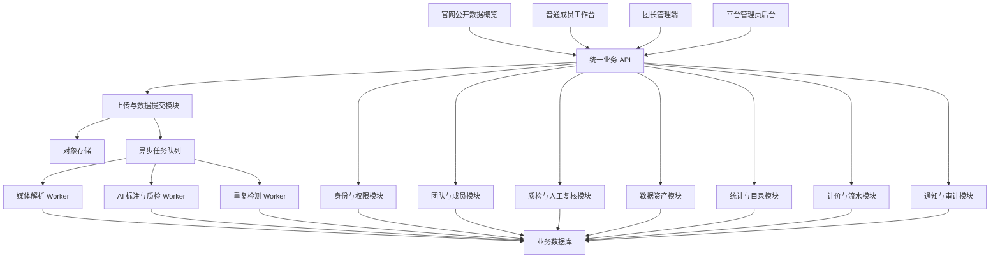

# 具身智能数据外包平台：总体方案与待确认事项

- 文档状态：方案基线 v0.11
- 编写日期：2026-07-31
- 最近更新：2026-07-31
- 使用对象：产品负责人、开发负责人、AI/数据开发
- 文档目的：确定系统大方向、识别开发前缺失决策、安排两到三人小团队的实施顺序
- 关联文档：[具身智能数据外包平台方案草案](./docs/superpowers/specs/2026-07-28-embodied-data-outsourcing-platform-design.md)

---

## 1. 结论先行

这套系统第一阶段不应被定义成一个“大而全的数据交易平台”，而应被定义成一条可运营、可追溯的：

> **具身数据生产流水线：人员管理 → 数据上传 → 自动处理 → AI 标注与质检 → 管理员复核 → 数据资产入库 → 统计与计价。**

结合当前业务阶段以及“产品经理 + 1～2 名开发者”的团队规模，推荐采用以下总体方向：

1. **已确认：一期先打通普通 RGB 视频的完整闭环。**
   - 原装 iPhone 相机视频可直接上传。
   - 上传格式只支持 MOV 和 MP4。
   - 分辨率、帧率、码率等媒体参数不设置准入门槛，只在后台解析和展示。
   - 暂不要求 IMU、6DoF 和深度。
   - 底层仍使用通用的“数据提交”模型，为后续多模态数据包留扩展位。

2. **登录后的后台使用同一套系统，按角色呈现不同页面。**
   - 官网公开概览。
   - 普通成员工作台。
   - 团长管理端。
   - 平台管理员后台。
   - 管理员、团长和普通操作员使用同一个账号密码登录页。
   - 登录后根据账号角色进入对应首页，并只显示有权限的菜单和页面。
   - 三个角色视图共用前端工程、业务服务、数据库和存储。

3. **技术上采用“模块化单体业务系统 + 异步 AI 处理流水线”。**
   - 业务逻辑集中在一个后端工程内，降低小团队维护成本。
   - 视频解析、AI 推理、重复检测等耗时任务在异步任务中执行。
   - 每个视频上传并校验完成后立即创建 AI 质检任务并进入等待队列。
   - 多台处理机器组成 Worker 池，从队列领取任务，处理能力可以后续按实际数据量扩容。
   - 不在一期拆成大量微服务，也不优先建设 Kubernetes 等重型基础设施。

4. **所有自动化结论都必须可追溯、可重跑，并允许在结算锁定前人工调整。**
   - 保留模型版本、规则版本、证据帧、问题时间段和原始输出。
   - 第一期不设置强制人工抽检队列，AI 完成评分后直接生成当前质检结论。
   - 管理员可查看和调整全平台未结算视频；团长可查看和调整本团未结算视频。
   - 人工修改不能覆盖 AI 原始结果，而应形成包含修改人、原因、时间和前后值的新审核记录。

5. **采用“待结算可调整、每日批次锁定”的计价机制。**
   - AI 质检完成后，数据先进入待结算阶段。
   - 每天 00:00 统一处理前一自然日完成质检的记录。
   - 批次锁定前允许有权限的管理员或团长人工调整质量评估。
   - 团长对本团未结算视频的调整直接生效，管理员保留全平台查看和调整权。
   - 结算成功后，应计金额直接进入数采人员账户的可用余额，数采人员可以手动发起提现。
   - 一期不建设结算后冲正或补差功能；进入结算批次后，质量结论和计价快照不可修改。

6. **原始文件、过程结果和可交付资产分层存储。**
   - 原始文件只读保留。
   - 转码视频、缩略图、抽帧、标签和质检结果作为派生数据。
   - 只有最终质量通过且完成结算锁定的数据才进入稳定的可交付资产统计口径。

以上是当前已确认的方案基线。第一阶段的数据接入范围已经锁定为普通视频，多模态数据不再阻塞一期平台设计。

---

## 2. 已经确定的业务边界

### 2.1 产品模式

- 不采用强制任务派发模式。
- 普通成员自主上传数据。
- AI 自动识别场景、动作和内容。
- 系统通过数据分布提示紧缺或已饱和的采集方向。
- 第一期采购商侧只提供公开数据概览和商务咨询入口。

### 2.2 用户和组织

- 内部只有一个平台大管理员。
- 外部只有团长和普通成员。
- 一个团长通常管理约 20 名普通成员。
- 团长可以查看本团数据和成员情况，并添加、移除成员。
- 普通成员只能访问自己的数据、结果和收入信息。
- 不设置外部运营人员、独立质检员和财务人员。
- 第一期不设置团长佣金和团队差价账户。

### 2.3 核心处理流程

```text
上传
→ 文件校验和媒体解析
→ 单文件进入 AI 质检队列
→ Worker 执行预检、标注、综合质检和重复检测
→ 生成百分制评分与结论
→ AI 结果进入“未结算、可人工调整”阶段
   ├── 当前最终分低于 60 分 → 质量不通过 → 不计费
   └── 当前最终分达到 60 分 → 质量通过 → 待结算
→ 管理员可调整全平台记录；团长可调整本团记录
→ 每天 00:00 按“完成质检时间”生成前一日结算批次并锁定最终结果
→ 合格数据正式进入可交付资产口径
→ 更新统计、生成收入流水并增加成员可用余额
→ 数采人员后续手动发起提现
```

### 2.4 数据和评分原则

- 质量、内容标签和数据价值分别建模。
- 命中硬性淘汰项时，评分结果必须被压到 60 分以下，不能用其他高分抵消；对外仍统一表现为“低于 60 分，质量不通过”。
- 稀缺度用于采集引导和数据分析，不进入一期结算公式。
- AI 原始分与人工调整后的最终分分别保存；每条数据的来源、处理过程、模型版本、人工修改和最终状态都可追溯。
- 公开统计只计算已验收、可交付的数据。

---

## 3. 目前还缺哪些决定

下面按优先级分为 P0、P1 和 P2：

- **P0：开发正式开工前必须确定。**
- **P1：核心闭环开发期间确定，不阻塞项目骨架。**
- **P2：一期跑通后再确定。**

## 3.1 P0：开发前必须确定

已经关闭的 P0 决策：

- **一期数据模态：只接收普通视频。**
- **一期数据单位：一个视频对应一份独立数据提交，独立排队、质检、入库和计价。**
- **一期视频格式：只支持 MOV 和 MP4。**
- **媒体参数策略：分辨率、帧率、码率、编码、时长等只解析和展示，不作为准入或淘汰条件。**
- **上传触发方式：每个文件上传并校验完成后立即进入 AI 质检队列，不等待整个上传批次。**
- **AI 通过门槛：总分大于等于 60 分为通过，低于 60 分为质量不通过。**
- **质量不通过：不进入可交付资产库，不产生计费；普通成员可以按原因重新采集并上传。**
- **AI 通过：进入可交付数据资产流程，并保存评分、分项结果、扣分原因和改进建议。**
- **质量系数：通过质检的视频仍按最终质量分映射不同质量系数，不采用“所有通过视频统一金额”的方案。**
- **质量系数分档：`score<60` 为 0；`60≤score<70` 为 0.7；`70≤score<80` 为 0.85；`80≤score≤100` 为 1.0，最高不超过 1。**
- **有效计费时长：按视频总时长减去 AI 识别出的明确无效区间计算，不直接使用整段原始时长，也不只统计细粒度动作片段。**
- **成员单价：平台必须设置默认成员单价；管理员可以为团队设置覆盖价，但不设置个人特殊价。**
- **计费公式：普通成员收入 = 成员单价 × 有效计费时长 × 质量系数。**
- **账号登录：管理员、团长和普通操作员使用同一套账号密码登录。**
- **角色页面：同一个系统根据用户角色展示不同首页、菜单、页面和操作。**
- **用户创建：管理员后台提供用户管理页面，由管理员新增账号、设置角色并配置所属团队。**
- **人工处理方式：第一期不设置强制人工抽检环节；管理员和团长按权限主动查看视频并调整未结算的质量评估。**
- **调整窗口：进入每日结算批次前，未结算数据允许人工调整；结算锁定时以当时的最终质量结果作为计价依据。**
- **结算频率：每天 00:00 对前一日满足条件的数据生成一个统一结算批次。**
- **团长调整：团长对本团未结算视频的质量调整直接生效，不需要管理员再次确认。**
- **批次归属：按 AI 完成质检的时间归属结算日；前一自然日完成质检的数据进入下一次 00:00 批次。**
- **结算入账：日结算成功后，应计金额直接增加到数采人员的账户可用余额。**
- **余额提取：数采人员可以从账户余额手动发起提现。**
- **提现金额：数采人员自行输入提现金额，金额不得超过当前可用余额。**
- **一期提现方式：用户提交申请后冻结对应余额，平台管理员审核并线下转账；第一期不接自动支付接口。**
- **一期收款渠道：默认使用支付宝，用户维护收款人姓名和支付宝账号。**
- **提现限制：最低提现金额做成可配置项，默认 100 元；不限制固定提现日期，同一用户同时只能有一笔未完成申请。**
- **提现结果：驳回、用户撤回或打款失败时，冻结金额原路退回可用余额。**
- **结算后修正：一期暂不考虑冲正、补差或修改已结算记录。**
- 不要求上传 IMU、6DoF、深度和标定文件。
- 不建设专用 iPhone 采集 App。
- 底层仍保留多文件和多模态扩展能力，但不进入一期页面和处理流程。
- 文件扩展名与实际容器格式不一致、文件损坏或无法解析时，仍视为技术上传失败。
- 平台基础设施可能存在单文件大小上限，但它属于容量与成本配置，不属于视频质量标准。

暂缓确认但保留在方案中的事项：

- **数据规模：**当前无法可靠估算首批人数、日上传量、文件大小和总存储规模，暂不锁定容量数字。
- **部署环境：**当前不锁定云厂商、部署地区和机器配置。
- 开发时通过对象存储、任务队列、可配置 Worker 并发数和无状态业务服务保留扩容能力。
- 以上事项不阻塞业务流程设计，但在试运行和正式上线前必须根据真实样本重新测算。

| 决策项 | 当前缺口 | 为什么会阻塞开发 | 推荐起点 | 最终需要形成的结果 |
|---|---|---|---|---|
| 返工记录关系 | 重新上传的视频是否需要关联原失败视频 | 影响返工追踪和人员质量分析 | 新视频形成新数据提交，并通过“返工来源”关联原记录；原记录不覆盖 | 返工关联规则 |
| 硬性淘汰条件 | 哪些问题直接判失败尚未量化 | 决定第一版质检是否可用 | 先定义 8～12 个可客观判断的硬规则 | 《质检规则 v1》 |
| 标签树 v1 | 场景、动作、对象和工具的首批词表未锁定 | AI 标注和统计页面都依赖它 | 先限制为 5～10 个场景大类、30～50 个高频原子动作 | 《标签体系 v1》 |
| 重复判定 | 完全相同、近似相同和同类内容如何处理 | 影响验收与计价 | 文件哈希只拦完全重复；视觉相似先标记候选，由规则或人工确认 | 重复检测规则 |
| 数据授权与隐私 | 上传协议、人脸、声音、地址、屏幕和定位信息处理方式未确定 | 不处理会产生数据交付和合规风险 | 上传前确认授权；默认禁止敏感内容；后台提供隔离与删除能力 | 上传协议和隐私规范 |
| 核心验收标准 | “闭环跑通”还没有量化 | 容易出现功能做了但无法上线 | 使用固定测试集定义成功率、处理时延和可恢复性 | 一期验收清单 |

### 已经解决的关键矛盾

现有方案一方面确认“第一阶段只做网站上传、不建设采集设备能力”，另一方面讨论了“视频＋IMU＋6DoF＋深度”数据。

现已确定一期只接收普通视频，因此不再存在实施冲突：

- 使用 iPhone 原装相机，只能稳定获得普通视频，不能获得可用于具身算法的完整 IMU、6DoF 和逐帧深度数据。
- 一期允许采集人员使用 iPhone 原装相机拍摄并上传普通视频。
- IMU、6DoF、深度和标定信息统一延后到多模态项目。

项目正式拆成：

- **一期：普通视频数据工厂。**
- **二期：多模态 Ego 数据采集与管理。**

## 3.2 P1：核心开发期间确定

| 决策项 | 推荐处理方式 |
|---|---|
| 质量分与质量系数 | 已确认采用只扣不奖的分档：`<60=0`、`[60,70)=0.7`、`[70,80)=0.85`、`[80,100]=1.0`；规则仍做成可配置版本 |
| 有效计费时长 | 已确认按“原始时长减明确无效区间”计算；无效区间阈值做成规则配置并保存版本 |
| 成员单价层级 | 已确认使用“平台默认价 + 团队覆盖价”；不设置个人价，团队未设置覆盖价时自动回退平台默认价 |
| 最低计费门槛 | 与质检规则一起用测试集校准，未通过验收时系数为 0 |
| 人工查看与调整记录 | 保存 AI 原始值、人工最终值、修改人、修改原因、修改时间和前后差异 |
| 结算前待处理提醒 | 首页展示即将进入下一批次但仍存在人工争议或系统异常的数据 |
| 团队人数上限 | 约 20 人只做提醒，不在一期硬性限制 |
| 成员加入和移除 | 邀请码加入；移除后保留历史数据和账务关系 |
| 通知方式 | 一期站内状态和列表提示；短信、微信或邮件后续按运营需要接入 |
| 普通成员收入展示 | 展示待结算金额、可用余额、提现中和已提现金额 |
| 统计刷新频率 | 运营后台近实时或小时级；公开官网按天刷新 |
| 公开样例 | 使用脱敏、低清预览或经过专门授权的样例 |
| 数据生命周期 | 原始文件、失败数据、派生文件和日志分别设置保留周期 |
| 客服和申诉 | 一期可用“返工原因 + 管理员人工处理”替代完整客服系统 |

## 3.3 P2：一期跑通后再决定

- 专用 iPhone 多模态采集 App。
- IMU、6DoF、深度、双目或专业设备数据包。
- 采购商登录、精确目录、样本申请和在线交付。
- 团长佣金、渠道差价和自动提现。
- 独立运营、质检、财务等内部角色。
- 自建模型训练平台和大规模标注回流。
- 跨项目、跨客户的数据授权和库存占用。
- 复杂合同、订单、报价和交付验收。
- 多地域存储、容灾和冷存储自动归档。

---

## 4. 三种总体建设方案

## 4.1 方案 A：模块化单体 + 异步 AI 流水线

这是当前推荐方案。

### 结构

- 一个共享业务后端。
- 一个关系型数据库。
- 一个对象存储。
- 一个任务队列。
- 若干独立 AI/媒体处理 Worker。
- 官网、成员端、团长端和管理端使用分开的路由与权限入口。

### 优点

- 适合 1～2 名开发者快速建设和维护。
- 登录、团队、数据、账务等业务事务容易保持一致。
- AI 任务可以独立扩容，不会阻塞网站请求。
- 后续可以按真正的性能瓶颈拆服务。

### 缺点

- 需要在同一个后端内部保持清晰模块边界。
- 如果没有提前规范，项目后期可能演变成难维护的大单体。

## 4.2 方案 B：云服务优先的 Serverless/托管方案

尽量使用托管身份、托管数据库、对象存储事件和云函数完成处理。

### 优点

- 服务器运维工作少。
- 早期流量较小时启动快。
- 上传、存储和事件触发可以直接使用云厂商能力。

### 缺点

- 视频和 AI 任务通常执行时间长、资源需求高，不完全适合云函数。
- 对具体云厂商依赖较深。
- 本地调试、成本控制和复杂任务重试可能更困难。

### 适用条件

只有一名偏产品和前端的开发者，且愿意深度依赖一家云厂商时可考虑。

## 4.3 方案 C：完整微服务和模型平台

将用户、团队、上传、质检、统计、计价和模型推理分别建设成服务。

### 优点

- 大规模后可以独立扩容和独立发布。
- 各团队职责清晰。

### 缺点

- 对当前人员规模明显过重。
- 部署、监控、接口、数据一致性和故障排查成本很高。
- 会把大量精力消耗在基础设施而不是业务闭环。

### 结论

一期不采用。只有当团队扩大、任务量增长并出现明确服务瓶颈后，再从方案 A 中逐步拆分。

## 4.4 方案比较

| 维度 | 方案 A：模块化单体 | 方案 B：托管优先 | 方案 C：微服务 |
|---|---:|---:|---:|
| 小团队开发效率 | 高 | 高 | 低 |
| 视频和 AI 任务适配 | 高 | 中 | 高 |
| 运维复杂度 | 中低 | 低 | 高 |
| 云厂商绑定 | 低 | 高 | 中 |
| 后续扩展性 | 高 | 中 | 高 |
| 当前推荐度 | **最高** | 备选 | 不推荐 |

---

## 5. 推荐的系统蓝图



### 5.1 一个公开页面和三个角色视图

#### 官网

- 可交付总量。
- 场景和动作大类分布。
- 数据能力说明。
- 脱敏样例。
- 商务咨询入口。

#### 普通操作员工作台

- 批量上传。
- 上传和处理进度。
- 质检、返工和验收结果。
- 个人有效时长和收入流水。
- 推荐采集方向。

#### 团长管理端

- 邀请、添加和移除成员。
- 成员上传量、通过率、返工率和有效时长。
- 本团数据列表和异常提醒。
- 本团场景与动作分布。

#### 平台管理员后台

- 全量用户和团队管理。
- 新增用户、设置账号密码、分配管理员/团长/普通操作员角色和所属团队。
- 数据提交列表、详情和处理队列。
- AI 结果、证据和结算前人工调整。
- 标签、规则和模型版本。
- 数据资产入库、目录和统计。
- 单价、计价、账户余额、收入流水和提现处理。
- 系统异常、任务重跑和审计日志。

### 5.2 同一套系统按角色展示页面

为了适配小团队，建议：

- 使用一个代码仓库。
- 登录后的后台使用同一个前端工程和同一个账号密码登录页。
- 登录成功后根据角色跳转到管理员、团长或普通操作员首页。
- 菜单、页面、按钮和数据范围根据角色变化。
- 公开官网可以放在同一工程的公开路由中，不参与后台角色登录。
- 后端共用同一套 API 和数据库。
- 每个角色使用独立的服务端权限策略。
- 权限不能只依靠隐藏前端菜单。

---

## 6. 核心数据模型

### 6.1 人员与组织

```text
用户 User
团队 Team
团队成员关系 TeamMembership
角色 Role
权限 Permission
```

`TeamMembership` 需要保留加入时间、离开时间和历史状态。成员被移除后，历史上传、质检和收入记录仍然归属于当时的团队。

### 6.2 上传与数据

```text
上传批次 UploadBatch
数据提交 Submission
原始文件 SourceFile
派生文件 DerivedFile
处理任务 ProcessingJob
```

设计原则：

- 批次只是上传归组，不直接参与质检和计价。
- 数据提交是全系统的业务主对象。
- 一期一个视频对应一个数据提交。
- 二期一个数据提交可以关联视频、IMU、位姿、深度和标定文件。
- 文件保存在对象存储，数据库只保存元数据、路径、校验和及状态。

### 6.3 标注与质检

```text
标签定义 LabelDefinition
视频级标签 SubmissionLabel
动作片段 Segment
片段标签 SegmentLabel
质检执行 QCRun
质检问题 QCIssue
人工复核 Review
规则版本 RuleVersion
模型版本 ModelVersion
```

同一份数据允许存在多次 `QCRun`，以支持模型升级、规则调整和任务重跑。最终结论单独保存，不覆盖机器原始结果。

### 6.4 数据资产与统计

```text
数据资产 Asset
资产版本 AssetVersion
分布快照 DistributionSnapshot
公开统计快照 PublicSnapshot
```

“已验收”和“已入库”必须分开。管理员确认质量合格后，数据仍可能因为授权、重复或交付格式问题暂时不能进入可交付资产库。

### 6.5 计价与流水

```text
单价规则 PriceRule
计价记录 PricingRecord
成员收入流水 LedgerEntry
对账批次 ReconciliationBatch
```

历史计价记录不允许直接覆盖金额和单价快照。第一阶段暂不建设结算后的冲正、补差或重新计价功能。

---

## 7. 核心状态和处理流程

不要使用一个字段同时表示上传、质检、入库和结算。建议分为四组状态。

### 7.1 上传状态

```text
待上传 → 上传中 → 校验中 → 上传完成
                   └→ 上传失败
```

### 7.2 质检状态

```text
待处理
→ 排队中
→ 解析中
→ 预检中
→ 标注中
→ 综合质检中
→ 已评分
   ├── 60 分及以上 → 质量通过
   └── 60 分以下 → 质量不通过
→ 人工已调整（可选，不是必经状态）
→ 最终通过 / 需要返工 / 已拒绝
```

### 7.3 资产状态

```text
未入库 → 候选资产 → 已入库 → 已归档 / 已下架
```

### 7.4 计价状态

```text
未计价 → 待结算（可调整）→ 结算锁定 → 已计入账户余额
```

账户余额之后另设提现状态：

```text
可用余额
→ 提交提现并冻结金额
→ 待管理员审核
   ├── 驳回 / 用户撤回 → 退回可用余额
   └── 审核通过 → 待线下打款
                     ├── 已完成 → 计入累计已提现
                     └── 打款失败 → 退回可用余额
```

AI 质检结论、资产状态、结算状态和提现状态必须分别保存。视频在结算锁定前可以因人工调整在“质量通过”和“质量不通过”之间变化；结算锁定时才固化该批次使用的最终质量结果、计费参数和金额快照，并将金额记入成员可用余额。

### 7.5 推荐的自动处理流水线

1. 上传完成后验证文件大小和校验和。
2. 单个文件校验完成后立即创建独立 AI 质检任务并进入等待队列。
3. 空闲 Worker 从队列领取任务；多台机器可以并行处理不同视频。
4. 使用媒体工具解析编码、分辨率、帧率、时长和音轨。
5. 生成低码率预览、缩略图和抽帧。
6. 执行文件级硬规则。
7. 执行清晰度、曝光、抖动、手部和有效动作检测。
8. 生成视频级场景标签。
9. 生成动作片段和片段级标签。
10. 生成视觉特征并执行重复候选检索。
11. 规则引擎汇总机器结果，生成百分制总分、分项分数、扣分原因和改进建议。
12. 保存不可覆盖的 AI 原始结果，并据 60 分门槛生成当前最终结论。
13. AI 处理完成的数据进入未结算阶段；管理员可以查看和调整全平台数据，团长可以查看和调整本团数据。
14. 人工调整保存人工分数、人工结论、原因、操作人、操作时间和调整前后值，不覆盖 AI 原始结果。
15. 每天 00:00 按 AI 质检完成时间创建前一自然日结算批次，锁定批次内记录的最终分、最终结论、有效时长、单价、质量系数和金额。
16. 结算锁定时，最终分低于 60 分的数据不计费；最终分达到 60 分的数据生成资产和统计，并通过收入流水增加成员可用余额。
17. 数采人员输入不超过可用余额的金额并提交提现，系统立即冻结该金额。
18. 平台管理员审核申请并线下转账，随后在后台标记完成；驳回、撤回或打款失败时释放冻结金额。

所有步骤必须支持：

- 幂等执行。
- 失败重试。
- 超时和失败原因记录。
- 从指定步骤重新运行。
- 模型和规则版本留痕。
- 单个文件失败不影响同批其他文件。

### 7.6 AI 任务状态与质量结论必须分开

AI 处理机器发生异常，不等于视频质量不合格。系统需要分别保存：

```text
AI 任务状态：
排队中 → 处理中 → 处理成功
                └→ 重试中 → 系统处理失败

视频质量结论：
未评分 → AI 通过 / AI 质量不通过
       → 最终通过 / 最终质量不通过
```

规则：

- 网络错误、模型服务异常、机器宕机和任务超时进入自动重试，不产生质量分。
- 重试次数达到配置上限后标记为“系统处理失败”，由管理员重跑或排查。
- 只有 AI 成功生成完整质检结果后，才能根据 60 分门槛判断质量通过或不通过。
- 系统处理失败不能记为数采人员质量失败，也不能直接判定不计费。

---

## 8. AI 和质检方案

## 8.1 一期不要先建设“模型训练平台”

一期的目标是验证业务闭环，而不是一次性解决所有视觉算法问题。推荐把质检能力做成可替换的检测器：

```text
检测器输入
→ 标准化结果
→ 规则引擎
→ 最终建议
```

检测器可以来自：

- 确定性媒体规则。
- 开源视觉模型。
- 第三方多模态模型 API。
- 自建推理服务。
- 人工结果。

只要输出遵守统一格式，后续可以替换模型而不重做后台。

## 8.2 第一期质检分层

### L0：文件和媒体合法性

- 文件能否完整读取。
- 实际容器格式是否为 MOV 或 MP4。
- 文件扩展名与实际容器格式是否一致。
- 后台能否成功解析视频流。
- 解析编码、分辨率、帧率、码率、时长和音轨等媒体参数并存储。

分辨率、帧率、码率、编码和时长本身不设业务准入阈值，不因参数高低直接淘汰。
- 是否存在异常截断。

### L1：基础画面质量

- 模糊。
- 曝光。
- 抖动。
- 黑屏或遮挡。
- 长时间静止。
- 手部出现比例。

### L2：内容和动作理解

- 是否为第一视角。
- 场景类别。
- 主要对象和工具。
- 动作片段。
- 动作完整性。

### L3：重复和数据价值

- 文件完全重复。
- 视觉近似重复。
- 场景、动作和对象组合的库存覆盖度。

### L4：综合判定

- 硬性淘汰原因。
- 质量分。
- 原始时长、无效区间和有效计费时长。
- 是否存在人工调整及其历史记录。
- 返工建议。
- 是否可进入资产库。

## 8.3 质检结果的最小数据结构

每个问题至少保存：

- 原因代码。
- 严重程度。
- 扣分值。
- 起止时间。
- 证据帧。
- 检测置信度。
- 模型或规则版本。
- 机器建议。
- 人工最终结论。

---

## 9. 文件和存储方案

### 9.1 存储分层

| 层级 | 内容 | 原则 |
|---|---|---|
| 原始层 | 用户上传的原视频或数据包 | 原样保存、只读、可校验 |
| 处理层 | 转码视频、缩略图、抽帧、特征和临时结果 | 可重新生成 |
| 元数据层 | 用户、提交、状态、标签、质检和账务 | 放在业务数据库 |
| 资产层 | 已验收并整理后的可交付数据 | 有明确版本和授权状态 |
| 审计层 | 登录、权限、人工修改、重跑和删除记录 | 不允许普通用户修改 |

### 9.2 上传方式

- 浏览器通过临时凭证直接上传到对象存储。
- 大文件使用分片上传和断点续传。
- 后端负责创建上传会话、签发凭证和确认完成。
- 上传完成后才创建后续处理任务。
- 使用客户端校验和或服务端校验和识别传输损坏和完全重复。

### 9.3 删除和下架

- 普通成员不能自行物理删除已经提交的数据。
- 管理员可将数据下架、隔离或进入删除流程。
- 物理删除必须记录操作者、原因、范围和时间。
- 被删除数据关联的质检和账务审计记录应按合规要求保留。

---

## 10. 推荐技术形态

下面是适合两名开发者的参考组合，不要求现在立即锁死具体框架：

| 层级 | 推荐形态 |
|---|---|
| 前端 | TypeScript + React/Next.js，使用成熟后台组件库 |
| 业务后端 | Python FastAPI 或团队更熟悉的同类框架 |
| 数据库 | PostgreSQL |
| 缓存与任务队列 | Redis + 成熟异步任务框架 |
| 文件存储 | S3 兼容对象存储或境内云 OSS/COS |
| 视频处理 | FFmpeg/FFprobe |
| AI 推理 | 独立 Worker，可调用第三方 API 或自建 GPU 服务 |
| 相似检索 | 初期使用 PostgreSQL 向量扩展或独立轻量向量索引 |
| 部署 | Docker + 托管数据库/对象存储，先不引入 Kubernetes |
| 监控 | 错误追踪、任务队列监控、结构化日志和基础告警 |

选择原则：

- 优先使用团队熟悉的技术。
- AI 和业务后端可以使用相同语言，降低协作成本。
- 视频文件不经过业务服务器转发。
- 任何模型和云服务都通过适配层调用，避免在业务代码中写死供应商。

---

## 11. 两到三人的团队如何分工

## 11.1 推荐配置：产品负责人 + 两名开发

### 产品负责人

- 确定业务规则、范围和优先级。
- 制定数据接入规范、标签体系和质检标准。
- 准备测试视频和人工标准答案。
- 负责原型、验收和外包团队试运行。
- 处理隐私、数据授权和采购商需求。

### 开发 A：全栈/产品工程

- 登录、权限和团队管理。
- 普通成员、团长和管理员界面。
- 上传交互、列表、详情、统计和计价页面。
- 业务 API 与前端联调。

### 开发 B：后端/AI 数据工程

- 对象存储、分片上传和任务队列。
- 媒体解析、视频派生文件和处理 Worker。
- AI 标注、质量检测、重复检测和规则引擎。
- 数据资产、可追溯性、任务监控和成本控制。

两名开发需要共同确定数据库模型、接口契约和部署方式，避免前后端各自形成一套状态定义。

## 11.2 只有一名开发时

必须进一步收缩：

- 优先做管理员后台和普通成员上传端。
- 团长端先做成员列表和数据汇总，不做复杂运营能力。
- 先接第三方模型或离线处理脚本，不自建完整模型服务。
- 日结算先完成余额入账；提现采用“用户发起申请 + 管理员线下处理”的轻量方式，不接自动支付通道。
- 公开官网只做静态统计页面。

## 11.3 如果有第三名开发

优先增加独立前端或测试/平台工程能力，而不是立刻拆微服务：

- 前端开发：负责四个产品入口和体验。
- 后端开发：负责业务、权限、上传和资产。
- AI/数据开发：负责视频处理、模型、质检和数据统计。

---

## 12. 推荐实施里程碑

不先给固定周数。每个里程碑完成后都可以独立验收，再根据开发者能力和数据规模估算时间。

### M0：规则和工程基线

- 将普通视频范围固化为一期数据接入规范。
- 固化 MOV/MP4 格式校验方式和后台媒体参数字段。
- 确认核心数据对象和状态机。
- 完成标签树和质检规则的第一版。
- 准备一组有人工标准答案的测试数据。

### M1：账号、团队和基础框架

- 管理员、团长和普通操作员共用账号密码登录页。
- 登录后根据角色进入对应首页和菜单。
- 管理员用户管理页面：新增账号、设置角色和所属团队。
- 团队、成员和服务端数据权限。
- 基础操作审计。
- 开发、测试和生产环境。

### M2：上传和文件处理

- 批量多选。
- 分片上传、断点续传和单文件重试。
- 媒体解析、预览、缩略图和基础硬规则。
- 数据提交列表和详情。

### M3：AI 标注和自动质检

- AI 质检等待队列、Worker 领取任务和可配置并发。
- 任务自动重试、系统失败和管理员重跑。
- 基础场景识别。
- 动作或有效片段识别。
- 画面质量检测。
- 重复候选检测。
- 模型、规则版本和证据记录。
- 百分制评分以及 60 分通过门槛。

### M4：人工查看调整和资产入库

- 管理员查看和调整全平台未结算视频。
- 团长查看和调整本团未结算视频。
- 人工调整原因、前后值和操作日志。
- 返工、拒绝、恢复通过和任务重跑。
- 可交付资产入库。
- 基础场景和动作统计。

完成 M4 即代表最核心的“上传—质检—存储”闭环可以试运行。

### M5：团队运营和计价

- 团长成员管理。
- 团队数据汇总和异常提醒。
- 每日 00:00 按质检完成时间生成前一日结算批次。
- 结算前调整窗口和批次锁定。
- 普通成员收入流水和可用余额。
- 数采人员自定义金额提现、余额冻结、管理员审核和线下打款状态。

### M6：公开数据概览

- 可交付数据总量。
- 场景和动作分布。
- 数据能力和脱敏样例。
- 商务咨询入口。

---

## 13. 一期上线验收建议

一期不能只用“页面完成”作为验收标准。建议至少验证：

### 功能闭环

- 普通成员能上传多个大视频。
- 网络中断后可以继续上传。
- 单个文件失败不影响同批其他文件。
- 单个文件校验完成后会立即进入 AI 质检等待队列。
- 增加处理机器后可以提高队列并发，不需要修改业务流程。
- 系统能自动生成媒体参数、标签和质检结果。
- AI 完成评分后不需要等待强制人工抽检，自动进入未结算阶段。
- 管理员能查看并调整全平台未结算视频，团长只能调整本团未结算视频。
- 人工调整不会覆盖 AI 原始结果，且能够查到修改人、原因、时间和前后值。
- 团长对本团未结算数据的修改直接生效，不需要管理员再次确认。
- 每天 00:00 可以按 AI 质检完成时间创建前一日结算批次，并锁定批次内的最终结论和计价快照。
- 结算金额能够准确增加到普通成员可用余额，重复执行批次不会重复入账。
- 普通成员可以从账户页面手动发起提现。
- 最终合格数据能进入资产库并更新统计。
- 团长只能查看本团，普通成员只能查看自己。

### 稳定性

- 同一个上传完成请求重复发送不会产生两份数据。
- 处理任务失败后可以重试。
- AI 服务不可用时数据不会丢失。
- AI 系统故障不会被记录成视频质量不通过。
- 每一步都有明确状态、错误信息和耗时记录。
- 原始文件与数据库记录可以相互核对。

### 业务正确性

- 用人工标注测试集检查硬规则和关键标签。
- 已发生人工调整的数据可以反向计算机器通过率、误杀率和漏检率。
- 计价使用验收结果和锁定单价，不会因后续改价改变历史金额。
- 失败、返工、下架和删除都有完整审计记录。

### 安全与权限

- 团长无法通过修改请求参数访问其他团数据。
- 普通成员无法访问其他成员的文件和收入。
- 对象存储地址不永久公开。
- 管理员高风险操作有审计记录。

---

## 14. 产品负责人接下来应准备的材料

这些材料比先画完整页面更重要：

1. **一期数据接入规范**
   - 支持的数据类型。
   - 只支持 MOV 和 MP4。
   - 媒体参数仅解析展示，不设置业务准入阈值。
   - 单文件大小只设置基础设施上限。
   - 一条数据的定义。
   - 合格和不合格样例。

2. **质检规则 v1**
   - 硬性淘汰项。
   - 评分维度。
   - 有效时长定义。
   - 自动验收和人工复核条件。

3. **标签体系 v1**
   - 场景。
   - 原子动作。
   - 对象。
   - 工具。
   - 同义词和未知标签处理方式。

4. **核心状态机**
   - 上传状态。
   - 质检状态。
   - 资产状态。
   - 计价状态。
   - 返工和重跑规则。

5. **标准测试数据集**
   - 合格样例。
   - 各类失败样例。
   - 重复样例。
   - 边界分数样例。
   - 人工标准答案。

6. **权限矩阵**
   - 管理员、团长和普通成员分别能查看和修改什么。

7. **容量与成本表**
   - 用户规模。
   - 每日文件数。
   - 平均与最大文件大小。
   - 保存周期。
   - AI 单条处理成本。

8. **上传协议与隐私规则**
   - 数据所有权和使用授权。
   - 敏感内容限制。
   - 下架和删除流程。
   - 对外样例授权。

---

## 15. 接下来建议按这个顺序确认

1. 成员单价修改后，按视频上传完成时间、AI 质检完成时间还是日结算时间决定使用新旧价格。
2. 返工重新上传的视频，是否需要在页面上与原失败视频建立关联。
3. 第一版内容质量淘汰条件和五项分数的具体扣分规则。
4. 第一版场景、动作、对象和工具标签树。
5. 公开官网允许展示到什么粒度。
6. 数据规模、部署环境和月度预算在获得真实上传样本后再确认。

每次只确认一个主题，形成明确结论后更新本文档和详细方案，避免多条业务规则同时变化。

---

## 16. 最终输出：应形成的方案包

在正式进入开发前，建议最终形成以下文档，而不是试图把所有内容塞进一份超长 PRD：

```text
00-产品范围与阶段规划.md
01-角色权限矩阵.md
02-数据接入与文件规范.md
03-数据模型与状态机.md
04-标签体系-v1.md
05-质检与人工复核规则-v1.md
06-系统架构与部署方案.md
07-容量成本与数据生命周期.md
08-一期页面与流程清单.md
09-一期验收测试清单.md
10-隐私授权与数据合规要求.md
```

本文档作为上述方案包的总索引和决策记录。每个专题被确认后，在本文档中保留结论和对应文档链接。

---

## 17. 已确认的第一项 P0 决策

已于 2026-07-31 确认：

> **第一阶段只接收 iPhone 原装相机等设备拍摄的普通视频；不把 IMU、6DoF 和深度作为一期强制数据。**

理由：

- 与“不建设采集设备、只做网站上传”的现有方向一致。
- 能先验证外包人员、上传、AI 质检、人工复核和数据入库是否真正可运行。
- 不会因为采集 App、传感器同步和多模态标准而拖慢核心平台。
- 底层使用“数据提交—原始文件”模型，后续增加多模态数据包时不需要推翻业务系统。

二期如决定增加多模态数据，需要建立独立子项目：

> **iPhone 多模态采集 App 与多模态数据格式规范。**

该子项目需要另行确定支持机型、采样率、坐标系、时间同步、深度格式、标定参数、数据包结构和端侧上传方式。

---

## 18. 已确认的第二项 P0 决策

已于 2026-07-31 确认：

> **一期上传只支持 MOV 和 MP4；不对分辨率、帧率、码率、编码和时长设置业务准入要求。**

实现要求：

- 前端文件选择器只允许选择 `.mov` 和 `.mp4`。
- 后端根据文件内容验证真实容器格式，不能只信任文件扩展名。
- 文件损坏、容器伪造或完全无法解析时，标记为技术上传失败。
- 不要求用户在上传前转码。
- 分辨率、帧率、码率、编码、时长、文件大小和音轨信息由后台自动解析并保存。
- 上述媒体参数在管理员的数据详情页展示，作为观察信息，不直接决定质检是否通过。
- 可在管理员视频列表中按需要选择性展示分辨率、时长和文件大小，完整参数放在详情页。
- 单文件大小的技术上限在完成容量测算后确定，不作为内容质量规则。

---

## 19. 已确认的第三项 P0 决策

已于 2026-07-31 确认：

> **每个视频上传并校验完成后立即进入 AI 质检队列；AI 生成百分制评分，60 分及以上通过，低于 60 分质量不通过且不计费。**

具体规则：

- 上传批次只负责归组和展示，不等待整个批次完成后统一提交。
- 每个视频拥有独立的任务、排队位置、处理状态、评分和结果。
- Worker 从队列领取任务；后续可以通过增加机器和并发数提高吞吐。
- 低于 60 分的视频保留原始记录、AI 结论和改进建议，但不进入可交付资产库，也不生成成员收入。
- 60 分及以上的视频生成 AI 通过结论并进入未结算阶段，不等待强制人工抽检。
- AI 任务运行失败不等于视频质量不通过，系统会自动重试，仍失败时交由管理员处理。
- AI 质检详情参考现有平台，展示总分、分项分、综合结论、扣分原因、问题时间段和改进建议。

---

## 20. 已确认的第四项 P0 决策

已确认一期账号与角色方案：

> **后台使用同一套系统和同一个账号密码登录页，根据账号角色展示不同首页、菜单、页面、按钮和数据范围。**

角色固定为：

1. 平台管理员。
2. 团长。
3. 普通操作员，即前文所称普通成员。

管理员后台增加“用户管理”页面，至少支持：

- 新增用户账号。
- 设置初始账号和密码。
- 设置或修改用户角色。
- 为团长和普通操作员配置所属团队。
- 查看用户的基础状态和所属团队。

第一阶段不优先处理自助注册、短信验证码、忘记密码、复杂账号删除、登录设备管理等边缘功能。

界面实现原则：

- 三个角色共用同一登录页。
- 登录成功后按照角色跳转到对应首页。
- 前端按角色显示菜单和按钮。
- 后端接口仍必须校验角色和数据范围，不能只依靠前端隐藏。

---

## 21. 已确认的第五项 P0 决策

已确认一期人工处理和每日结算主规则：

> **不设置强制人工抽检环节。AI 评分完成后数据进入未结算阶段；管理员和团长可以在权限范围内主动查看视频并调整质量评估。每天 00:00 按 AI 质检完成时间对前一自然日数据生成统一结算批次，批次生成前的未结算数据均允许人工调整。**

权限范围：

- 平台管理员可查看和调整全平台未结算视频。
- 团长可查看和调整自己及本团普通成员的未结算视频。
- 团长的调整直接成为当前最终结果，不需要管理员再次确认。
- 普通操作员只能查看自己的结果，不能修改质量评估。

结果保存：

- `AI 原始分`、`AI 原始结论`永久保留。
- `人工调整分`、`人工调整结论`单独保存。
- 页面实际使用`最终分`和`最终结论`判断是否计费。
- 每次人工调整记录修改人、角色、原因、时间、调整前值和调整后值。
- 人工可以把低于 60 分的记录调整为通过，也可以把达到 60 分的记录调整为不通过；最终仍统一使用 60 分门槛判断。

结算锁定：

- 每天 00:00 创建一个日结算批次。
- 数据按 AI 质检完成时间归属自然日，不按上传完成时间或人工调整时间归属。
- 批次锁定质量最终结果、有效计费时长、成员单价、质量系数和应计金额快照。
- 结算锁定前允许人工调整；锁定后不允许直接覆盖原质量结果和账务记录。
- 结算成功后，应计金额通过收入流水直接增加到数采人员可用余额。
- 第一期暂不处理结算后的误判修正，不提供冲正、补差或修改已结算记录的入口。

该规则意味着人工查看是一个随时可发起的管理动作，而不是所有数据都必须经过的流程节点。

---

## 22. 已确认的第六项 P0 决策

已确认一期结算与账户余额的关系：

> **每日 00:00 的结算会把前一自然日完成 AI 质检且最终满足计费条件的数据金额，直接计入对应数采人员的账户可用余额。数采人员可以从账户余额手动发起提现。**

结算入账需要保证：

- 按 `AI 质检完成时间`确定日结算批次归属。
- 同一条数据只能正常结算并入账一次。
- 批次重复执行不能重复增加账户余额。
- 每次余额变化必须对应一条不可删除的收入或提现流水。
- 可用余额不能通过页面直接改数字，只能由结算入账、提现冻结、提现退回等业务流水改变。

账户页面至少展示：

- 待结算金额。
- 可用余额。
- 提现处理中金额。
- 累计已结算金额。
- 累计已提现金额。
- 收入与提现流水。
- 手动提现入口。

一期提现默认规则：

- 数采人员自行输入提现金额，金额必须大于等于平台最低提现额且不超过可用余额。
- 最低提现额做成后台配置项，默认 100 元。
- 提交后立即冻结申请金额，防止同一笔余额重复申请。
- 同一用户同时只能存在一笔未完成的提现申请。
- 用户可以在管理员审核前撤回；撤回后冻结金额退回可用余额。
- 平台管理员审核通过后使用支付宝线下转账，第一期不接自动支付接口。
- 用户资料保存收款人姓名和支付宝账号；提交提现时保存账户快照，后续修改资料不改变历史申请。
- 管理员驳回时必须填写原因；驳回或打款失败后冻结金额退回可用余额。
- 管理员确认线下转账成功后，申请变为已完成并计入累计已提现金额。
- 第一期不收取提现手续费，也不限制固定提现日期。

---

## 23. 已确认的第七项 P0 决策

已确认质量分参与普通成员收入计算：

> **最终质量分达到 60 分后，不是所有视频都按同一倍率计费，而是根据最终质量分映射质量系数。**

一期计费公式固定为：

```text
普通成员收入 = 成员单价 × 有效计费时长 × 质量系数
```

一期质量系数 v1：

| 最终质量分 `score` | 质量系数 |
|---|---:|
| `score < 60` | 0 |
| `60 ≤ score < 70` | 0.7 |
| `70 ≤ score < 80` | 0.85 |
| `80 ≤ score ≤ 100` | 1.0 |

规则说明：

- 命中硬性淘汰项时，无论其他分项得分如何，质量系数为 0。
- 质量系数只做低质量扣减，最高为 1，不设置高分质量奖金。
- 结算使用人工调整后的最终质量分；没有人工调整时使用 AI 原始分。
- 质量系数规则必须带版本，结算时保存命中的档位、系数和规则版本快照。
- 后续修改系数只影响尚未结算的数据，不追溯修改历史结算。
- 单条收入先按完整精度计算，再四舍五入保留到人民币分；日结算批次汇总已经完成单条舍入的金额。

---

## 24. 已确认的第八项 P0 决策

已确认一期有效计费时长采用“保守扣除明确无效区间”：

> **有效计费时长 = 视频原始时长 − 所有明确无效区间合并后的总时长。**

一期明确无效区间包括：

- 正式操作开始前的设备佩戴、镜头调整和准备时间。
- 最后一次有效操作结束后的收尾、摘取设备和无关录制时间。
- 持续较长时间没有任何有效操作的静止或等待。
- 采集人员离开操作场景，画面中不存在有效交互。
- 镜头被完全遮挡、画面持续全黑或无法辨认。
- 与本次具身操作明显无关的中断片段。

保守扣除原则：

- 正常操作过程中的短暂停顿、思考和动作衔接仍计费。
- 普通无动作区间连续达到 5 秒后才作为无效候选，阈值可配置。
- 完全遮挡、全黑或无法辨认的区间连续达到 1 秒后可作为无效候选，阈值可配置。
- 多个无效区间发生重叠时先合并再计算，不能重复扣减。
- 不要求 AI 精确切出每一个原子动作；动作片段标签和计费无效区间是两类不同结果。

计算和人工调整：

- AI 保存每个无效区间的开始时间、结束时间、原因、置信度和规则版本。
- 管理员可调整全平台未结算视频的无效区间；团长可调整本团未结算视频的无效区间，修改直接生效。
- 人工修改必须保留修改人、原因、前后区间和时间记录。
- 页面不允许只输入一个没有证据的“有效时长”数字；修改有效时长需要通过增加、删除或调整无效区间完成。
- 结算时锁定原始时长、无效区间快照、最终有效秒数和计费时长规则版本。

计费换算：

```text
有效秒数 = max(0, 原始秒数 − 合并后无效秒数)
有效计费时长（小时） = 有效秒数 ÷ 3600
收入 = 成员单价 × 有效计费时长（小时） × 质量系数
```

视频最终质量不通过时，无论有效秒数是多少均不计费。若有效秒数为 0，则该视频不产生收入。

---

## 25. 已确认的第九项 P0 决策

已确认一期普通成员单价采用两级命中方式：

> **实际成员单价 = 团队覆盖价（如已设置）；否则使用平台默认成员单价。**

单价层级：

1. 团队覆盖价。
2. 平台默认成员单价。

规则边界：

- 平台必须始终存在一个有效的默认成员单价。
- 团队覆盖价为可选配置；删除或停用后，该团队自动回退平台默认价。
- 同一团队内的所有普通成员使用相同团队覆盖价。
- 第一期不设置个人特殊价，避免同团成员出现难以解释的个别价格。
- 只有平台管理员可以新建、修改、停用单价；团长和普通成员均不能修改。
- 团长可以查看本团当前适用单价；普通成员可以查看自己的当前适用单价。
- 每条收入明细展示结算时使用的成员单价快照，不能只展示当前最新价格。
- 单价单位固定为人民币元/小时，后台按大于 0 且最多两位小数进行校验。
- 单价配置和变更必须记录操作人、变更前后值、原因和时间。

后台需要提供：

- 平台默认成员单价设置。
- 团队价格列表。
- 团队覆盖价新增、修改、停用和恢复。
- 当前生效价格来源展示：`团队覆盖价`或`平台默认价`。
- 单价变更历史。

单价修改后使用新旧价格的时间锚点尚未确认，将在下一轮决定。
